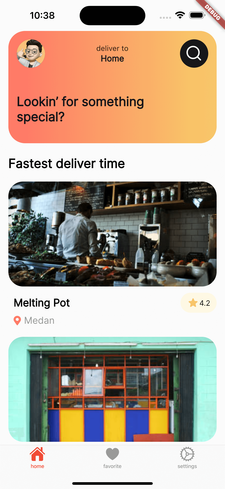
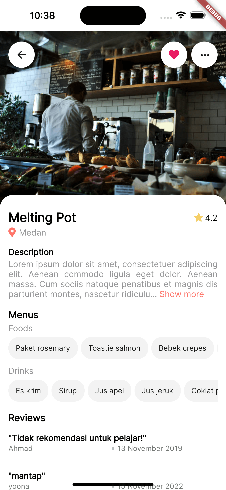
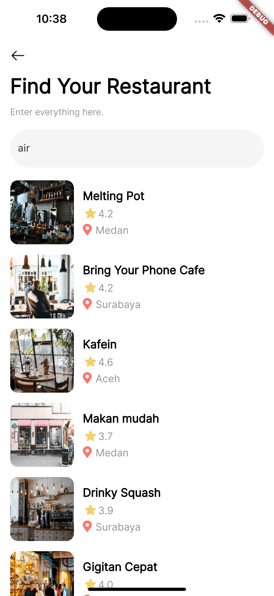
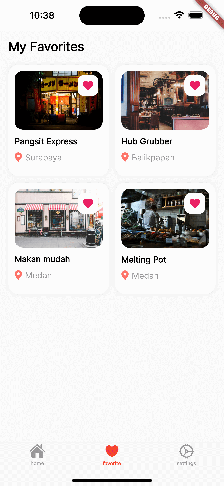
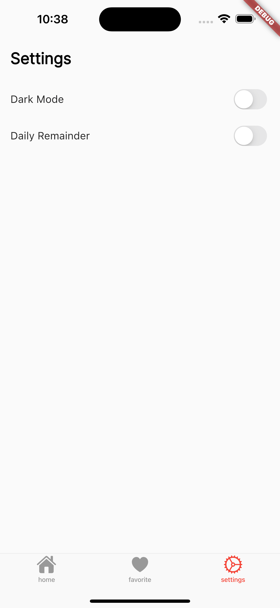

## Description

Projek ini merupakan projek yang digunakan sebagai proyek akhir yang menjadi syarat dalam kelulusan pada kelas [Belajar Fundamental Aplikasi Flutter](https://www.dicoding.com/academies/195). Berikut kriteria/fitur submission yang harus ada :
1. Favorite Restaurant
    - Pengguna harus bisa menambah dan menghapus restoran dari daftar favorit menggunakan database lokal.
    - Aplikasi harus mempunyai halaman untuk menampilkan daftar favorit
    - Menampilkan halaman detail dari daftar favorit.
2. Daily Remainder
    - Terdapat pengaturan untuk menghidupkan dan mematikan reminder di halaman setting.
    - Daily reminder untuk menampilkan restoran secara acak pada pukul 11.00 AM.
3. Testing
    - Menuliskan minimal satu skenario pengujian untuk memverifikasi proses parsing json telah berhasil.

## Development Setup

Clone the repository and run the following commands:

```
flutter pub get
flutter run
```

## Source

[Dicoding Academy](https://www.dicoding.com/academies/195) <br>
[Dicoding Data Restaurant API](https://restaurant-api.dicoding.dev/)

## Screenshot

 &nbsp;  &nbsp;  &nbsp;  &nbsp;  
